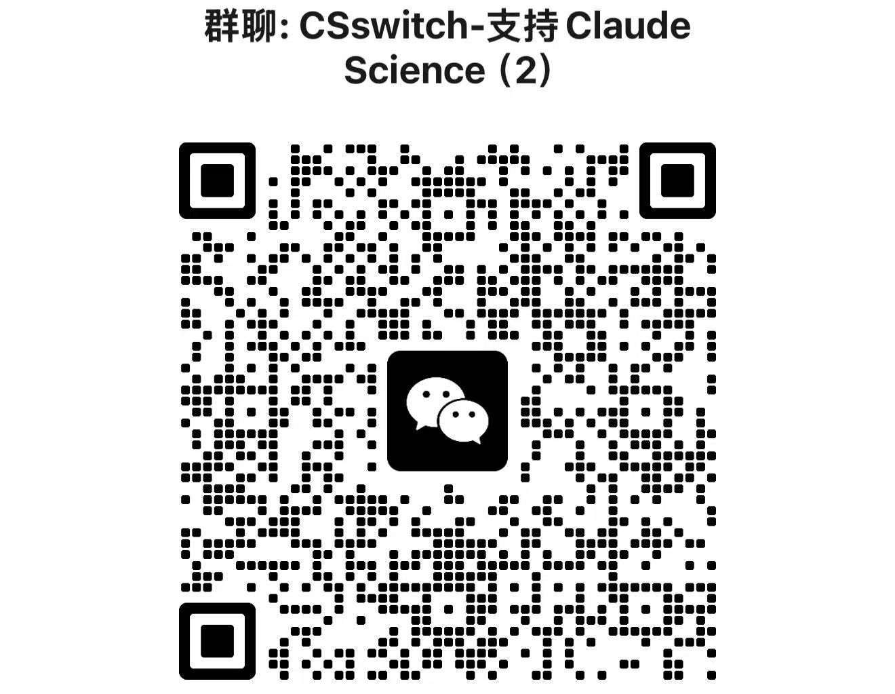

<p align="center">
  
</p>

<p align="center">
  <strong>README</strong><br>
  <a href="./README.md">🇨🇳 中文</a> ·
  <a href="./README.en.md">🇺🇸 English</a>
</p>

<p align="center">
  <a href="https://github.com/SuperJJ007/CSSwitch"></a>
  <a href="./LICENSE"></a>
  <a href="https://github.com/SuperJJ007/CSSwitch/releases/latest"></a>
  
  
</p>

<p align="center">
  <strong>更自由、流畅的研究体验。</strong>
</p>

<p align="center">
  CSSwitch 让 Claude Science 接入你自己的模型 API。<br>
  在主流 Provider、Codex 与自定义兼容端点之间自由切换。
</p>

<p align="center">
  
</p>

---

<p align="center">
  <a href="https://github.com/SuperJJ007/CSSwitch/releases/download/v0.8.0/CSSwitch_0.8.0_aarch64.dmg">下载 v0.8.0</a> ·
  <a href="#功能介绍">功能介绍</a> ·
  <a href="#安装与启动">安装与启动</a> ·
  <a href="#provider-与模型">Provider 与模型</a> ·
  <a href="#使用-codex">Codex</a> ·
  <a href="#skill">Skill</a> ·
  <a href="#mcp">MCP</a>
</p>

## 功能介绍

| 功能 | 当前状态 | 说明 |
| --- | --- | --- |
| Provider 与模型 | 已支持 | 连接内置 Provider、中转站和自定义兼容端点，自由填写并严格映射 Science 使用的模型。 |
| Codex | 实验功能 | 使用 CSSwitch 独立浏览器登录和账号动态模型目录；默认关闭，不读取或修改原生 `~/.codex` 登录。 |
| Skill | 已支持 | 查看当前 Science 组织中的 Skill，从本地包导入，或让 Agent 从准确的公开 GitHub URL 安装。 |
| MCP | 即将支持 | v0.8.0 尚未提供面向用户的通用 MCP 添加、配置和运行管理；后续版本会继续完善。 |

## 社区

<p align="center">
  
</p>

## 安装与启动

需要一台 Apple Silicon Mac、已安装的 [Claude Science](https://claude.com/download)，以及可用的第三方模型 API Key 或 Codex 账号。

### 第一次安装

1. 下载 [`CSSwitch_0.8.0_aarch64.dmg`](https://github.com/SuperJJ007/CSSwitch/releases/download/v0.8.0/CSSwitch_0.8.0_aarch64.dmg)，打开后将 CSSwitch 拖入「应用程序」。
2. 确认电脑上已经安装 [Claude Science](https://claude.com/download)，然后打开 CSSwitch。
3. 首次打开如被 macOS 阻止，请在 Finder 中右键 CSSwitch，选择「打开」。

### 连接第三方模型

1. 进入「模型连接」，点击「新增配置」。
2. 选择一个内置 Provider；使用中转站或自建服务时，选择对应的兼容端点并填写 `base_url`。
3. 填写 API Key 和模型名称。默认模型必须填写；高质量、快速和 Fable 模型可以留空，也可以直接填写上游提供的精确模型 ID。
4. 保存配置并点击「设为当前」。
5. 回到首页，保持「第三方模型」模式，点击「一键开始」。
6. Science 打开后，在顶部模型选择器中选择需要的模型。CSSwitch 显示的是你配置的真实模型名。

需要回到原来的 Claude 账号和官方模型时，在首页切换到「官方 Claude」并打开 Science；CSSwitch 会先停止自己管理的第三方链路。

### 使用 Codex

1. 进入「设置」，打开「启用 Codex 实验入口」。
2. 点击「浏览器登录 Codex」，在系统浏览器完成 CSSwitch 自己的独立授权。
3. 登录成功后，Codex 配置会自动出现在「模型连接」中，但不会自动替换当前 Provider。
4. 将 Codex 配置「设为当前」，回到首页点击「一键开始」。
5. 在 Science 的模型选择器中选择 `Codex / …` 模型。模型列表来自当前账号的动态目录，CSSwitch 不会补造账号中不存在的模型。

### 安装与查看 Skill

1. 先通过「一键开始」启动隔离 Science，等待运行状态正常。
2. 打开「Skill & MCP」，点击「刷新」查看当前 Science 组织中发现的 Skill、来源和绑定状态。
3. 本地包可以点击「导入本地 Skill 包」，选择 `.zip` 或 `.skill`；公开 GitHub Skill 则在 Science 中把准确 URL 交给 Agent，由 CSSwitch connector 完成安装。
4. 页面显示“已绑定”后，仍建议在当前 Agent 会话调用对应的 `skill()`，确认它已经实际加载。

## Provider 与模型

- **内置 Provider：** DeepSeek、通义千问、智谱 GLM、小米 MiMo、硅基流动、Kimi、MiniMax、OpenRouter。
- **自定义端点：** Anthropic Messages、OpenAI Chat Completions 和 OpenAI Responses 兼容 API；模型名称可以直接填写，不依赖自动发现。
- **模型选择：** 普通配置可只填一个模型，也可以分别设置质量、均衡、快速和 Fable。Science 显示真实模型名，不使用 `default` 占位名称。
- **Codex：** 使用 CSSwitch 独立浏览器登录和动态账号模型目录；不读取或修改原生 `~/.codex` 登录。

不同 Provider 对工具调用、thinking、图片、长上下文和流式输出的支持并不相同。CSSwitch 会严格按当前配置映射模型，未知模型不会静默切换到别的模型。

## Skill

CSSwitch 当前聚焦于安全地把外部 Skill 接入隔离 Science，而不是再造一个 Skill 市场或通用 MCP 管理器。

- **查看现有 Skill：** 页面读取当前 Science 组织中真实存在的 Skill，展示来源、单 Skill / bundle 形态，以及 `attached`、`detached`、`unknown` 三种 OPERON 绑定状态。Science 未运行或身份无法确认时不会猜测结果。
- **导入本地包：** 通过系统文件选择器导入 `.zip` 或 `.skill`，自动识别单 Skill 与多 Skill bundle；前端不接收或提交本地文件路径。
- **从 GitHub 安装：** 可以让 Science Agent 通过 CSSwitch 的专用安装桥接安装准确的公开 GitHub 仓库、集合或 Skill 目录 URL。CSSwitch 宿主负责匿名下载、固定 commit、校验、提交和绑定，不使用 Science 或用户的 GitHub 凭证。
- **安全提交：** 安装前检查 archive 大小、文件数量、路径穿越、符号链接、特殊文件和名称冲突；提交过程保持原子性，同名或已被修改的内容不会被静默覆盖。
- **区分发现、绑定与加载：** 列表中“已绑定”只代表 OPERON 实时回读成功，不等于当前 Agent 会话已经加载。单 Skill 安装后仍应在 Science 中调用 `skill()` 做最终验证。
- **bundle 生命周期：** bundle 会保留 `_shared` 和支持资源；从任一成员发起卸载都必须先展示完整影响列表并由用户确认，随后才整包 detach 和隔离回收，不做成员级静默删除。

公开 GitHub Skill 安装在内部使用一个窄范围 connector，只负责安装、卸载和长任务状态查询；它是 Skill 安装链路的一部分，不代表 CSSwitch 已经支持通用 MCP。详细合同见[外部 Skill bridge](./docs/features/external-skill-bridge.md)。

## MCP

通用 MCP 支持正在开发中。当前 v0.8.0 还不能让用户在 CSSwitch 中添加、编辑或管理自己的 MCP server，也不应把 Skill 安装所用的内部 connector 当成完整 MCP 功能。后续支持范围以对应版本的 README 和更新日志为准。

## 安全与隔离

- 第三方模式使用独立 HOME、data-dir 和本地回环 Gateway，不读取或修改真实 Claude 登录与 Science 数据。
- API Key 保存在本机 `~/.csswitch/config.json`，文件权限为 `0600`；凭据不会写入日志。
- 官方 Claude 模式会停止第三方代理链路，再打开真实 Science。
- CSSwitch 不下载、固定或自动升级 Claude Science；启动时优先使用当前安装的官方 App。

## 当前边界

- 公开桌面包目前只支持 macOS Apple Silicon。
- 第三方模式不提供 Anthropic 账号权限，托管 MCP、目录连接器和部分云端能力可能不可用。
- Codex 仍是默认关闭的实验能力，当前只支持单账号浏览器登录。
- Rust Gateway 已随应用打包，不需要单独安装 Python runtime。

升级、回滚和已知限制见[项目文档](./docs/README.md)。问题反馈请使用 [GitHub Issues](https://github.com/SuperJJ007/CSSwitch/issues)。

## 开发

```bash
cd desktop
npm install
npm run tauri dev
```

完整检查：

```bash
bash test/run_all.sh
```

[更新日志](./CHANGELOG.md) · [开发与测试](./docs/operations/development.md) · [发布证据](./docs/evidence/releases/README.md)
